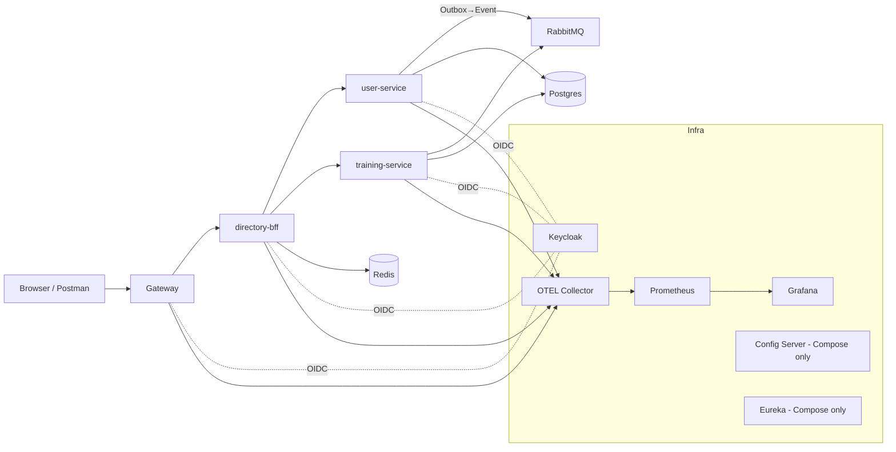

Savršeno 👌 Evo ti kompletan **premium root `README.md`** sa svim dodacima za **Checkstyle** i **SonarCloud** (badges, workflow reference, quality sekcija).
Možeš ga copy–paste direktno u root projekta.

---

# TeamNest Enterprise Microservices Demo

> ⚡ **Enterprise-grade microservices showcase** — a condensed version of a real multi-club platform in production (17 clubs, \~1000 users).
> Built for **CV/portfolio purposes**: clean architecture, proven enterprise patterns, observability, and cloud-native deployment.

<p align="center">
  
  
  
  
  
  
  
</p>

<p align="center">
  <a href="https://sonarcloud.io/dashboard?id=your_project_key">
    
  </a>
  <a href="https://sonarcloud.io/dashboard?id=your_project_key">
    
  </a>
  <a href="https://sonarcloud.io/dashboard?id=your_project_key">
    
  </a>
</p>

---

## Table of Contents

* ✨ [Highlights](#-highlights)
* 🏗️ [Architecture Overview](#️-architecture-overview)
* 🚀 [Quick Start (Docker Compose)](#-quick-start-docker-compose)
* 🎬 [Demo Scenarios](#-demo-scenarios)
* ☸️ [Cloud-Native (Kubernetes)](#️-cloud-native-kubernetes)
* 🔐 [Security (Keycloak)](#-security-keycloak)
* 📏 [API Standards](#-api-standards)
* 📊 [Observability](#-observability)
* 🛡️ [Reliability](#️-reliability)
* 🧪 [Testing & Quality](#-testing--quality)
* 🛠️ [Tooling & Workflow](#️-tooling--workflow)
* 📂 [Project Layout](#-project-layout)
* 📚 [Per-Service READMEs](#-per-service-readmes)
* 🗺️ [Roadmap](#️-roadmap)
* 📄 [License](#-license)

---

## Highlights

* **Domain boundaries**

  * `user-service` → registration, RBAC, Outbox/Saga
  * `training-service` → sessions, RSVP, attendance
  * `directory-bff` → aggregation + ETag/304 + Redis cache-aside
  * `gateway` → API Gateway (CORS, rate limiting, headers)
* **Event-driven consistency**: Outbox → RabbitMQ → projectors
* **Security**: Keycloak OIDC (roles: ADMIN, COACH, PLAYER, PARENT, STAFF)
* **Observability**: OpenTelemetry → Prometheus + Grafana (p95 latency, RPS, error rate)
* **Reliability**: Resilience4j (timeouts, retries, circuit breaker), ProblemDetail (RFC7807), Idempotency-Key
* **Deploy anywhere**:

  * 🚀 **Docker Compose** (with Spring Config Server + Eureka)
  * ☸️ **Kubernetes manifests** (ConfigMap/Secret, probes, DNS discovery — no Eureka/Config Server)

---

## Architecture Overview



---

## Quick Start (Docker Compose)

> Requirements: Docker (Compose v2), JDK 17+, Maven.

```bash
# 1. Clone & enter
git clone https://github.com/yourname/teamnest-enterprise-demo.git
cd teamnest-enterprise-demo/deploy

# 2. Configure
cp .env.example .env

# 3. Start infra
docker compose up -d

# 4. (Optional) Build services
cd ..
mvn clean package -DskipTests
```

**Consoles & UIs**

* Gateway (Swagger proxied): `http://localhost:8080`
* Keycloak: `http://localhost:8081` (admin/admin)
* RabbitMQ: `http://localhost:15672` (guest/guest)
* Prometheus: `http://localhost:9090`
* Grafana: `http://localhost:3000` (admin/admin)

---

## Demo Scenarios

### 1. Registration Saga

```bash
http POST :8080/api/v1/users/registrations \
  Idempotency-Key:$(uuidgen) \
  email='alice@example.com' password='Secret123' firstName='Alice' lastName='Doe'
```

* Outbox event → RabbitMQ → projector in training-service.

### 2. Training search (ETag + Redis)

```bash
http GET :8080/api/v1/trainings?teamId=TEAM1&from=2025-01-01&to=2025-12-31
```

* Returns **ETag**; repeat with `If-None-Match` → 304 if unchanged.

### 3. RSVP (idempotent + rate-limited)

```bash
http POST :8080/api/v1/trainings/TR-123/rsvp status=GOING \
  Authorization:"Bearer <access_token>" \
  Idempotency-Key:$(uuidgen)
```

---

## Cloud-Native (Kubernetes)

* Manifests in `k8s/`:

  * `base/` → infra (Postgres, Redis, RabbitMQ, Keycloak, Prometheus, Grafana)
  * `services/` → per-service Deployment + Service + ConfigMap + Secret + probes
  * `ingress/` → ingress rules
* Apply with:

```bash
kubectl apply -f k8s/base/
kubectl apply -f k8s/services/
kubectl apply -f k8s/ingress/
```

* Images pulled from GHCR: `ghcr.io/yourname/<service>:<tag>`

---

## Security (Keycloak)

* Realm: `demo` (`deploy/keycloak/realm.json`)
* Roles: `ADMIN`, `COACH`, `PLAYER`, `PARENT`, `STAFF`
* Each service → resource server (JWT).

---

## API Standards

* **Errors**: RFC 7807 ProblemDetail
* **Pagination**: `page,size,sort` + `X-Total-Count`
* **Idempotency**: `Idempotency-Key` header
* **ETag/304**: for collection endpoints
* **Correlation**: `X-Correlation-Id` propagated via MDC + MQ headers

---

## Observability

* **OpenTelemetry** traces
* **Prometheus** metrics
* **Grafana** dashboards (pre-provisioned):

  * Latency (p95)
  * Throughput (RPS)
  * Error rate (5xx)
  * RabbitMQ ready/ack rate

---

## Reliability

* Resilience4j (timeouts, retries, circuit breakers)
* DLQ for failed outbox relay events
* Optimistic locking with `@Version`
* Tenant-aware filtering ready via claims

---

## Testing & Quality

* Unit + slice tests
* Integration: Testcontainers (Postgres, Redis, RabbitMQ)
* Mutation testing (PIT, ≥60% threshold)
* Static analysis: **Checkstyle** (Google Java Style)
* Code quality: **SonarCloud** (coverage, code smells, vulnerabilities)
* GitHub Actions CI:

  * Build + tests
  * JaCoCo report
  * SonarCloud scan
  * Checkstyle verify
  * Publish images to GHCR
  * Security scan (OWASP / Trivy)

---

## Tooling & Workflow

* GitHub Actions CI/CD
* SonarCloud (quality gate, coverage, smells)
* Checkstyle (Google Java Style rules)
* OWASP Dependency Check / Trivy
* **Code review assisted by ChatGPT**
* **Merge quality gates via Qodo Merge Pro**

---

## Project Layout

```
.
├─ gateway/
├─ user-service/
├─ training-service/
├─ directory-bff/
├─ shared/
├─ deploy/        # Docker Compose demo
│  ├─ docker-compose.yaml
│  ├─ config-repo/*.yml
│  ├─ grafana/provisioning/*
│  └─ prometheus/prom.yml
├─ k8s/           # Kubernetes manifests
│  ├─ base/
│  ├─ services/
│  └─ ingress/
├─ scripts/       # dev-up, dev-down, seed, postman-run
├─ .github/workflows/ci.yaml
└─ README.md
```

---

## Per-Service READMEs

Each service has its own README:

* Purpose & bounded context
* Endpoints (with curl examples)
* Events published/consumed (schemas)
* Entities & DB schema
* Tests & resilience notes

---

## Roadmap

* Contract tests (Spring Cloud Contract)
* K8s HPA manifests for scaling
* Canary header demo in BFF (`X-Canary`)
* Optional gRPC adapter between services

---

## License

MIT License — see `LICENSE`.
